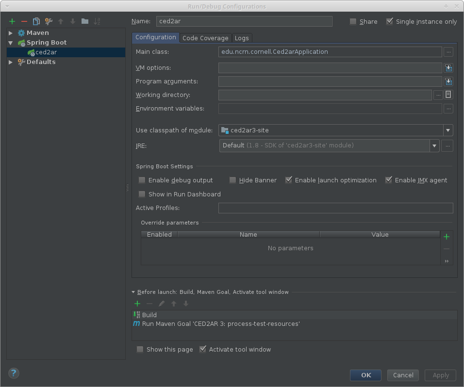
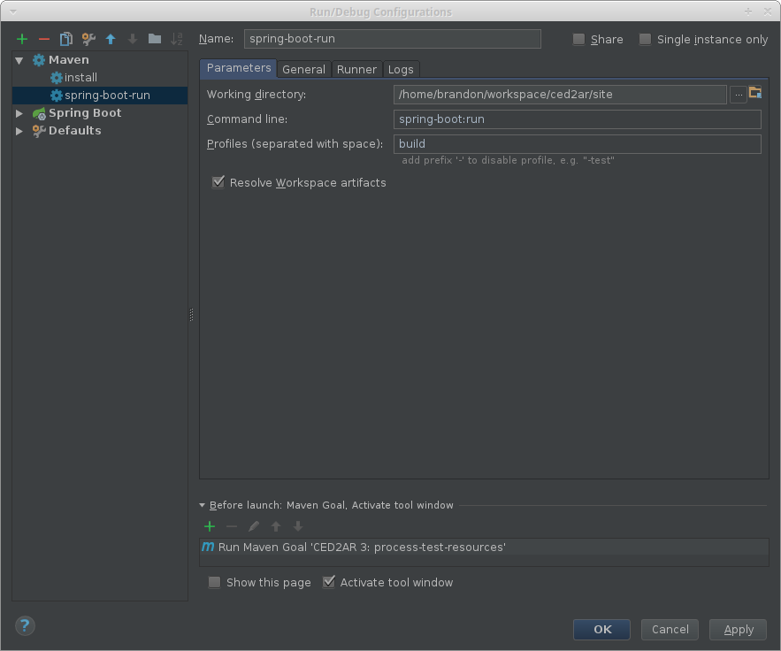

# Building CED2AR

* Dev builds can be executed by using `mvn install`.
* Production builds need the `build` profile: `mvn install -Pbuild`. This will apply a variety of production-level settings, such as full optimization of generated JavaScript code.
* IntelliJ Spring Boot application runner: Under `Edit configurations...`, you'll want to add the following maven goals before the 'Before Launch' part of the configuration, after 'Build'

    1. `antrun:run` (for windows only); generates JavaScript
    2. `process-test-resources`; places JavaScript files in appropriate directory
    3. If the IntelliJ build step tries to compile code meant for sbt, you can right click on the build output log and select something like "exclude from compile" or "exclude from build". Since an image says a thousand words, here is an example config for IntelliJ on Linux:
    
    4. Browse to [http://localhost:8080/ced2ar-rdb/app](http://localhost:8080/ced2ar-rdb/app), or if you've changed the default `spring.port` or ` server.contextPath` change `8080` or `/ced2ar-rdb` as appropriate. Note that `/app` takes you to the [SPA](https://en.wikipedia.org/wiki/Single-page_application) whereas `/codebook` will take you to a good entrypoint for the [MVC](https://en.wikipedia.org/wiki/Model%E2%80%93view%E2%80%93controller) application.

Unfortunately, there is a [long-standing bug](https://youtrack.jetbrains.com/issue/IDEA-107048) in IntelliJ, so you may be better off using `mvn spring-boot:run` (should work for other IDEs as well):

# Configuring CED2AR

Options should be chosen by by editing `ced2ar3-site/WEB-INF/classes/application-default.properties` in production, or `site/src/main/resources/application-default.properties` during development. Common settings to override:

* `spring.datasource.url` = your db connection string, e.g., jdbc:postgresql://ip/db
*  `spring.datasource.username` = your db user name
*  `spring.datasource.password` = your db password
*  `ced2ar.uploadDir` = An absolute path to the folder where xml files are uploaded by users. 